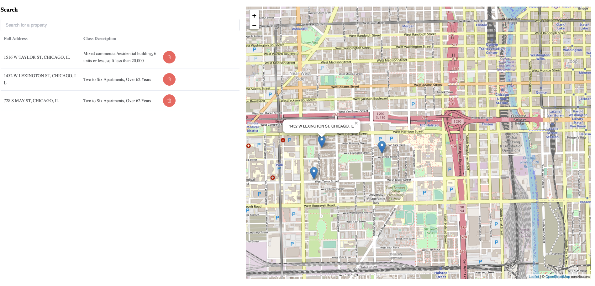

# How to run python api

```
cd enodo-backend
pip3 install -r requirements.txt
cd enodo
python3 run_api.py
```
A falcon api will start at [http://localhost:8000](http://localhost:8000) with the following routes

```
/search returns list of matching properties

params:
query_string: the address of the property you are looking for. Will return partial matches. Optional

selected: if the record is currently selected. 0 for false; 1 for true. Optional

limit: max number of records to return. Optional


/selected updates if a property is selected based on passed param

params:
property: Full Address of property. Required

selected: 0 for false. 1 for true. Required
```
# How to run the tests

```
cd enodo-backend
python3 tests.py
```
# How to run the vue frontend
```
cd enodo-frontend
npm install
npm run serve
```

The frontend will start at [http://localhost:8080](http://localhost:8080)

Frontend features:
1. Property search with autocomplete
2. Table updated on selection; change is reflected in database
3. Map with marker at GPS coordinates of selected property
4. Clicking on a marker will display the associated address
5. Clicking the trash can will remove the property from the table and map

Example below:

